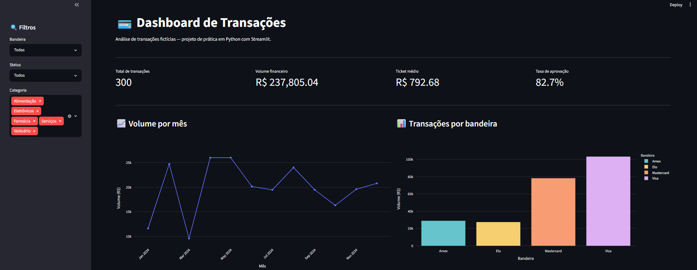

# 💳 Dashboard de Transações

> 🎓 Projeto de prática — desenvolvido durante meus estudos de Data Science com Python.

Dashboard interativo de análise de transações fictícias desenvolvido com Streamlit e Plotly.



## ✨ Funcionalidades

- KPIs de volume, ticket médio e taxa de aprovação
- Filtros por bandeira, status e categoria
- Gráfico de linha, barras, pizza e barras horizontais
- Tabela interativa com dados filtrados

## 🛠️ Tecnologias


## 📁 Conteúdo

- [dashboard_transacoes.py](dashboard_transacoes.py) — aplicação principal

## 🚀 Como executar

```bash
pip install streamlit plotly pandas numpy
streamlit run dashboard_transacoes.py
```
